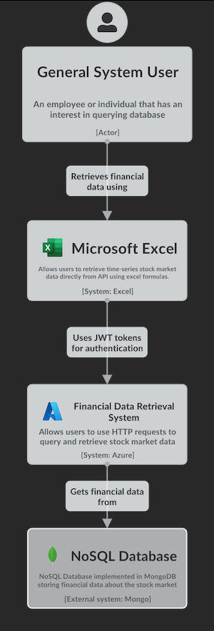
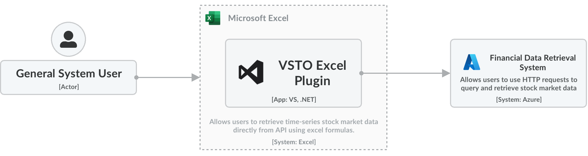
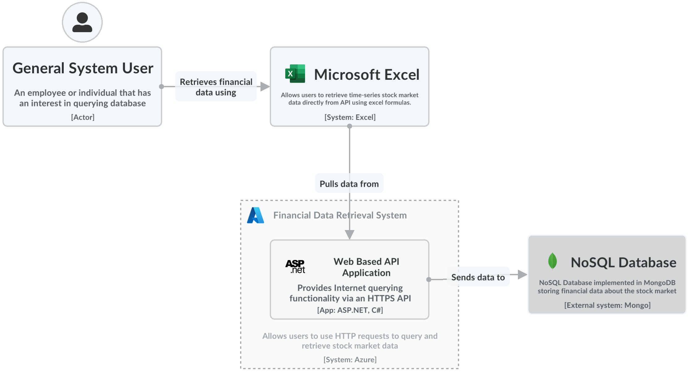
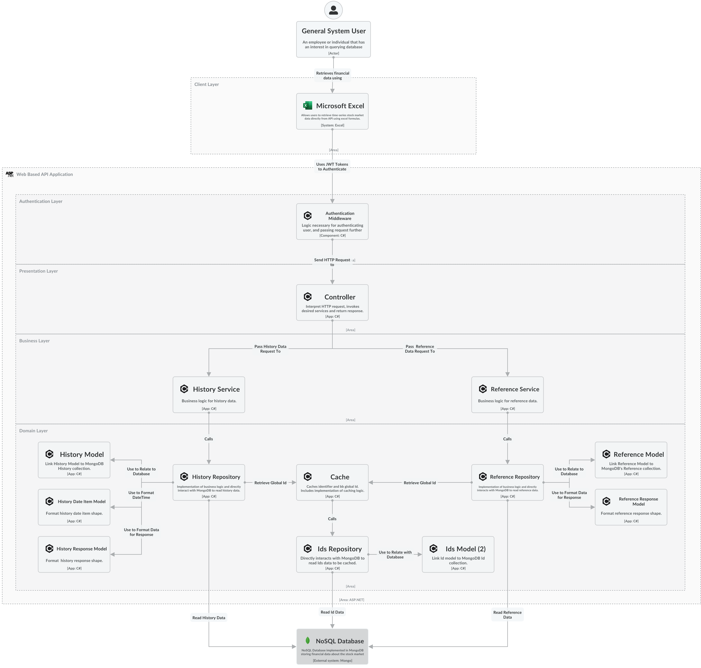

# Viewpoint API - Capstione project

Before starting, make sure: 
- `MongoDB.Driver` is installed
- `.env` file is present in the `./ViewpointAPI` directory containing the database connection string

# C4 Diagram
Last updated: February 14, 2024

## Level 1 - Context Diagram

## Level 2 - Container Diagram 
### Microsoft Excel 

### Financial Data Retrieval System

## Level 3 - Component Diagram
### Excel Plugin 
[In-Progress]

### Web Based API

## Level 4 - Code Diagram 
[TBD]

